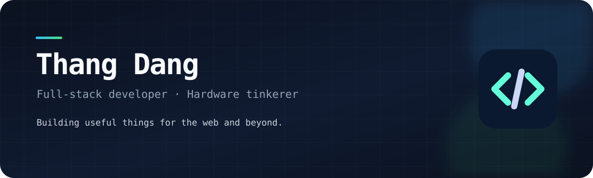

  

 

  
  
  

## Hello, I'm Thang 👋

I build practical software across the stack—from web applications and developer tooling to small embedded and IoT experiments. I enjoy turning real-world problems into systems that are simple to operate, easy to maintain, and genuinely useful.

- 🔭 Exploring developer automation, self-hosted infrastructure, and connected devices
- 🧰 Working across PHP, TypeScript, C++, Shell, Docker, and Linux
- ⚡ Interested in ESP32, Raspberry Pi, Home Assistant, and hardware-software projects
- 🧭 Always learning, refining workflows, and shipping useful things

## Toolbox

  

## What I work on

| Area | Focus |
| --- | --- |
| Web engineering | PHP applications, WordPress, Yii2, TypeScript, and APIs |
| Dev tooling | Shell scripts, Docker-based environments, and workflow automation |
| Embedded & IoT | ESP32, C++, Raspberry Pi, PWM control, and smart-home integrations |
| Systems | Linux, self-hosting, networking, and dependable deployments |

## Selected projects

<table>
  <tr>
    <td width="50%" valign="top">
      <h3><a href="https://github.com/vthang87/script-tools">script-tools</a></h3>
      
A growing collection of small Shell utilities for repeatable development and system tasks.

      
<code>Shell</code> <code>Automation</code> <code>Tooling</code>

    </td>
    <td width="50%" valign="top">
      <h3><a href="https://github.com/vthang87/PwmControl">PwmControl</a></h3>
      
An ESP32-S3 and PlatformIO project for PWM motor control with an encoder and OLED display.

      
<code>C++</code> <code>ESP32</code> <code>PlatformIO</code>

    </td>
  </tr>
  <tr>
    <td width="50%" valign="top">
      <h3><a href="https://github.com/vthang87/wp-docker">wp-docker</a></h3>
      
A Docker image and supporting scripts for WordPress setup, cron, plugins, and migrations.

      
<code>Docker</code> <code>WordPress</code> <code>Shell</code>

    </td>
    <td width="50%" valign="top">
      <h3><a href="https://github.com/vthang87/hass-button">hass-button</a></h3>
      
A TypeScript project exploring custom controls and Home Assistant integrations.

      
<code>TypeScript</code> <code>Home Assistant</code> <code>IoT</code>

    </td>
  </tr>
</table>

---

  Build thoughtfully. Automate the boring parts. Keep learning.

